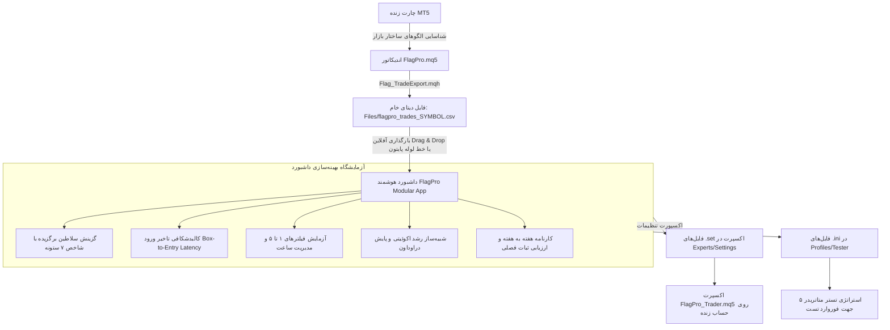

# 🏛️ مستندات جامع معماری و ساختار پروژه FlagPro (FlagPro Architecture & Ecosystem Blueprint)

> **نسخه اکوسیستم:** v2.5 Modular Enterprise  
> **محیط اجرایی:** MetaTrader 5 (MQL5) + HTML5/ES6 Standalone Dashboard + Python Automation Pipeline  
> **هدف کلان:** سیستم نهادی شناسایی الگوهای ساختار بازار، استخراج دیتای خالص، کالبدشکافی آماری هج‌فاندی، بهینه‌سازی تعاملی در آزمایشگاه وب و اجرای خودکار الگوریتمی با مدیریت ریسک پلکانی.

---

## 📑 فهرست مطالب
1. [چشم‌انداز و فلسفه طراحی (Core Philosophy)](#1-چشمانداز-و-فلسفه-طراحی-core-philosophy)
2. [چرخه حیات استراتژی و جریان داده (End-to-End Workflow)](#2-چرخه-حیات-استراتژی-و-جریان-داده-end-to-end-workflow)
3. [نقشه ساختار پوشه‌ها و فایل‌های پروژه (Directory Tree)](#3-نقشه-ساختار-پوشه‌ها-و-فایل‌های-پروژه-directory-tree)
4. [اجزای سه‌گانه سیستم (The 3 Core Pillars)](#4-اجزای-سه‌گانه-سیستم-the-3-core-pillars)
   - [۴.۱. اندیکاتور و موتور استخراج MQL5](#۴۱-اندیکاتور-و-موتور-استخراج-mql5)
   - [۴.۲. داشبورد ماژولار و آزمایشگاه استراتژی (Modular App)](#۴۲-داشبورد-ماژولار-و-آزمایشگاه-استراتژی-modular-app)
   - [۴.۳. اکسپرت معامله‌گر خودکار MQL5](#۴۳-اکسپرت-معامله‌گر-خودکار-mql5)
5. [سیستم خروج پلکانی ۴ مرحله‌ای (4-Stage Scale-Out Engine)](#5-سیستم-خروج-پلکانی-۴-مرحله‌ای-4-stage-scale-out-engine)
6. [شاخص هج‌فاندی ۷ ستونه سلاطین (7-Pillar King Score)](#6-شاخص-هج‌فاندی-۷-ستونه-سلاطین-7-pillar-king-score)
7. [فیلترهای هوشمند ضد استاپ (فیلترهای ۱ تا ۵)](#7-فیلترهای-هوشمند-ضد-استاپ-فیلترهای-۱-تا-۵)
8. [خط لوله ابزارهای خودکارساز پایتون (Python Pipeline)](#8-خط-لوله-ابزارهای-خودکارساز-پایتون-python-pipeline)
9. [قوانین توسعه و گیت پروژه (Git & Development Rules)](#9-قوانین-توسعه-و-گیت-پروژه-git--development-rules)

---

## ۱. چشم‌انداز و فلسفه طراحی (Core Philosophy)

اکوسیستم **FlagPro** بر یک اصل بنیادین استوار است:
> **«جداسازی کامل استخراج داده از تصمیم‌گیری استراتژیک»**

```
 ┌────────────────────────┐      دیتای خام ۱۰۰٪ جامع (بدون فیلتر)      ┌────────────────────────┐
 │   اندیکاتور FlagPro    │ ─────────────────────────────────────────► │    داشبورد هوشمند      │
 │  (MQL5 Chart Scanner)  │                                            │ (Strategy Laboratory)  │
 └────────────────────────┘                                            └────────────────────────┘
                                                                                    │
                                                                   تولید کانفیگ بهینه (.ini / .set)
                                                                                    │
                                                                                    ▼
 ┌────────────────────────┐         اجرای دقیق با مدیریت ریسک پلکانی    ┌────────────────────────┐
 │   MetaTrader Tester    │ ◄───────────────────────────────────────── │     اکسپرت تریدر       │
 │   & Real Accounts      │                                            │    (FlagPro_Trader)    │
 └────────────────────────┘                                            └────────────────────────┘
```

1. **اندیکاتور فیلتر نمی‌کند:** وظیفه اندیکاتور صرفاً اسکن دقیق الگوها و ثبت ۱۰۰٪ دیتای خام همه باکس‌ها بدون هیچ‌گونه فیلتر حذفی در فایل CSV است.
2. **داشبورد آزمایشگاه است:** کاربر فیلترهای ۱ تا ۵، الگوهای سلاطین، کف سود و ساعات معاملاتی را در داشبورد تعاملی تست می‌کند، بازدهی لحظه‌ای چارت اکوئیتی را می‌بیند و بهترین کانفیگ را صادر می‌کند.
3. **اکسپرت تریدر مجری است:** اکسپرت دقیقاً فایل تنظیمات خروجی از داشبورد را دریافت کرده و با اردرهای لیمیت و محافظت‌های ۴ پله‌ای ترید می‌کند.

---

## ۲. چرخه حیات استراتژی و جریان داده (End-to-End Workflow)



---

## ۳. نقشه ساختار پوشه‌ها و فایل‌های پروژه (Directory Tree)

```
MQL5/
├── Experts/                                  # ربات‌های معامله‌گر خودکار
│   ├── FlagPro_Trader.mq5                   # کد سورس اکسپرت اصلی
│   ├── FlagPro_Trader.ex5                   # فایل کامپایل‌شده اجرایی اکسپرت
│   ├── Settings/                            # تنظیمات استاندارد لاتین (.set)
│   └── تنظیمات/                             # تنظیمات با نام‌های فارسی
│
├── Indicators/                               # اندیکاتورهای چارت متاتریدر
│   ├── FlagPro.mq5                          # کد سورس اندیکاتور اصلی استخراج و رسم
│   └── FlagPro.ex5                          # فایل کامپایل‌شده اجرایی اندیکاتور
│
├── Include/
│   └── FlagPro/                             # ماژول‌های مهندسی‌شده هسته اندیکاتور
│       ├── Flag_Types.mqh                   # ساختارها و تعاریف داده‌ای (Structs & Enums)
│       ├── Flag_TradeTypes.mqh              # انواع داده معاملات، خروج‌ها و وضعیت باکس
│       ├── Flag_Boxes.mqh                   # موتور پردازش باکس‌ها، تلاقی‌ها و سطوح
│       ├── Flag_Filters.mqh                 # توابع ارزیابی فیلترهای ساختاری و نویز
│       ├── Flag_Pivots.mqh                  # شناسایی پیوت‌های کف و سقف فرکتالی
│       ├── Flag_Render.mqh                  # رسم گرافیکی باکس‌ها، تارگت‌ها و استاپ روی چارت
│       ├── Flag_Sync.mqh                    # ماژول همگام‌سازی زنده تستر با اندیکاتور چارت (Auto-Sync)
│       ├── Flag_TradeAutoScan.mqh           # اسکن خودکار تاریخچه و کشف معاملات
│       ├── Flag_TradeExport.mqh             # اکسپورتور ۱۰۰٪ جامع دیتای خام به CSV
│       └── Flag_TradeInteractive.mqh        # پنل تعاملی روی چارت متاتریدر
│
├── FlagPro_Modular_App/                     # معماری ماژولار داشبورد هوشمند (HTML/JS/CSS)
│   ├── index.html                           # پوسته اصلی HTML داشبورد
│   ├── css/
│   │   └── main.css                         # استایل‌های تم دارک، کارت‌های KPI و جداول
│   ├── html_components/                    # کامپوننت‌های ماژولار تفکیک‌شده HTML (زیر ۱۰۰ الی ۴۰۰ خط)
│   │   ├── sidebar.html                     # منوی کناری ناوبری
│   │   ├── header.html                      # هدر اصلی و نوار ابزار سوییچ نماد
│   │   ├── tab_equity.html                  # ساختار کامل تب رشد سرمایه و اسلایدرها
│   │   ├── tab_trades.html                  # ژورنال معاملات
│   │   ├── tab_tester_compare.html          # ساختار تب کالبدشکافی تستر متاتریدر
│   │   ├── tabs_other.html                  # سایر تب‌های ساختاری
│   │   └── modals.html                      # مودال‌های ذخیره سناریو و اعتبارسنجی
│   ├── template.html                        # تمپلیت مستر فوق سبک داشبورد با ماژولار اینکلود (۶۱ خط)
│   ├── js/
│   │   ├── core/
│   │   │   ├── app.js                       # کنترلر ناوبری، تب‌ها و استارت‌آپ
│   │   │   ├── data_store.js                # هسته سبک داده و سوییچ نماد (۲۰۸ خط)
│   │   │   ├── utils.js                     # توابع کمکی زمان، دیرکرد ورود (Latency) و فرمت‌ها
│   │   │   ├── presets_engine.js            # موتور شبیه‌ساز سناریوها، خروج پلکانی و ضرر
│   │   │   ├── csv_loader.js                # لودر خودکار CSV، درگ‌اند‌دراپ و متریک‌های ۷ ستونه
│   │   │   └── exporter.js                  # تولیدکننده فایل‌های .ini و .set برای متاتریدر
│   │   ├── equity/                          # ماژول‌های تفکیک‌شده اکوئیتی (جایگزین فایل ۲,۴۲۸ خطی)
│   │   │   ├── equity_presets.js            # سناریوهای ذخیره‌شده، لوکال‌استوریج و مودال
│   │   │   ├── equity_controls.js           # پنل تعاملی سلاطین، اسلایدر سود، فیلترها و ساعات
│   │   │   ├── equity_engine.js             # الگوریتم شبیه‌سازی، فیوز استاپ‌های متوالی و بهینه‌ساز
│   │   │   └── equity_canvas.js             # الگوریتم رسم کنواس، تولتیپ‌ها و لایه‌بندی
│   │   ├── tester_compare/                  # ماژول‌های تفکیک‌شده کالبدشکافی تستر (جایگزین ۲,۲۱۸ خط)
│   │   │   ├── tester_scenarios.js          # فرمت سناریوها و تطابق با استراتژی
│   │   │   ├── tester_matcher.js            # موتور تطبیق زمانی/قیمتی معاملات با تستر
│   │   │   ├── tester_renderer.js           # رندرر کارت‌های KPI، جدول تفاوتی و چارت
│   │   │   └── tester_parser.js             # پارسر آپلود فایل‌های گزارش HTML و CSV تستر
│   │   └── tabs/
│   │       ├── tab_equity.js                # ارکستراتور فوق سبک تب اکوئیتی (۱۸ خط)
│   │       ├── tab_kings.js                 # جدول سلاطین، اشتراک طلایی و مقایسه
│   │       ├── tab_timeframes.js            # تحلیل تایم‌فریم‌ها، راهنمای لیمیت و سورت‌ها
│   │       ├── tab_weekly.js                # کارنامه هفته به هفته و چارت میله‌ای ثبات
│   │       ├── tab_journal.js               # ژورنال تفصیلی معامله به معامله با صفحه‌بندی
│   │       └── tab_tester_compare.js        # ارکستراتور تب مقایسه تستر (۳۷۶ خط)
│   ├── data/
│   │   └── initial_data.js                  # حافظه کَش آفلاین برای اجرا بدون اینترنت
│   ├── dist/
│   │   └── FlagPro_Modular_App.html         # نسخه تک‌فایلی مستقل باندل‌شده (Single-File)
│   └── tools/
│       └── bundler.py                       # اسکریپت باندل‌ساز خودکار HTML، CSS و JS
│
├── dashboard_builder/                       # پکیج خط لوله پایتون
│   ├── __init__.py                          # فایل تعریف ماژول
│   ├── builder.py                           # پردازش دسته‌ای فایل‌های CSV نمادها
│   ├── pipeline.py                          # تولید initial_data.js، اجرای باندلر و استقرار
│   ├── presets.py                           # ساخت ۵ سناریوی بهینه اتوماتیک برای هر نماد
│   └── tester_compare.py                    # پردازش گزارش‌های تستر متاتریدر
│
├── Files/                                   # پوشه ارتباطی مشترک متاتریدر ۵
│   ├── flagpro_trades_GBPUSD.csv            # خروجی دیتای معاملات نماد GBPUSD
│   ├── flagpro_trades_EURUSD.csv            # خروجی دیتای معاملات نماد EURUSD
│   ├── flagpro_performance_dashboard.html   # داشبورد مستقرشده جهت مشاهده مستقیم
│   └── gbpusd_performance_report.html       # گزارش مستقل نماد
│
├── FlagPro_Master_Dashboard.html            # نسخه نهایی داشبورد در روت پروژه
├── build_master_dashboard.py                # اسکریپت اصلی بیلد و انتشار سراسری
├── flagpro_bridge_server.py                 # سرور محلی وب‌سوکت/HTTP همگام‌سازی لحظه‌ای
├── Update_Dashboard.bat                     # لانچر سریع به‌روزرسانی با یک کلیک
└── PROJECT_STRUCTURE.md                     # این سند (نقشه جامع پروژه)
```

---

## ۴. اجزای سه‌گانه سیستم (The 3 Core Pillars)

### ۴.۱. اندیکاتور و موتور استخراج MQL5
- **فایل:** `Indicators/FlagPro.mq5` + کتابخانه‌های `Include/FlagPro/`
- **مسئولیت:**
  - تشخیص هندسی باکس‌ها بر مبنای پیوت‌های فرکتالی ۳، ۵ و ۸.
  - تعیین سطح دقیق ورود (Entry)، حد ضرر (SL) و چهار سطح هدف سود (TP1 تا TP4).
  - ثبت زمان تشکیل باکس، زمان ورود پولبک، و مدت تاخیر (Latency).
  - ثبت ۱۰۰٪ معاملات رخ داده در تاریخچه در قالب فایل استاندارد CSV با ستون‌های:
    `Symbol, Role, Timeframe, BoxName, Direction, BoxTimeStart, BoxTimeEnd, EntryTime, ExitTime, EntryPrice, StopLoss, RiskPoints, HitTargetRatio, TP1, TP2, TP3, TP4, IsClosed, Outcome`

### ۴.۲. داشبورد ماژولار و آزمایشگاه استراتژی (Modular App)
- **فایل:** `FlagPro_Modular_App/` و خروجی تک‌فایلی `FlagPro_Master_Dashboard.html`
- **مسئولیت:**
  - **محیط کاملاً آفلاین و ایزوله:** بدون وابستگی به هیچ کتابخانه یا سرور خارجی.
  - **شبیه‌سازی اکوئیتی Real-Time:** محاسبه رشد بالانس، قله سرمایه (HWM)، حداکثر افت (Max DD) و همپوشانی تریدهای باز همزمان.
  - **کالبدشکافی تاخیر ورود (Box-to-Entry Latency):** تعیین میانگین و چارک ۹۰٪ زمان تاچ اردر لیمیت برای تعیین تاریخ انقضای هوشمند اردرها در هر تایم‌فریم.
  - **جعبه ابزار فیلترهای زنده ۱ تا ۵:** روشن و خاموش کردن بلادرنگ فیلترها و مشاهده آنی تاثیر بر سود و وین‌ریت.
  - **تولید خودکار کانفیگ:** صدور فایل‌های استاندارد `.ini` (برای Strategy Tester) و `.set` (برای Expert Advisor).

### ۴.۳. اکسپرت معامله‌گر خودکار MQL5
- **فایل:** `Experts/FlagPro_Trader.mq5`
- **مسئولیت:**
  - خواندن پارامترهای تولیدشده توسط داشبورد (`InpAllowedKings`, `InpFilterNightHours`, `InpFilterPreLondonHunt`, ...).
  - ست کردن خودکار اردرهای Buy Limit و Sell Limit بر مبنای باکس‌های تشکیل‌شده.
  - اعمال خروج پله‌ای با حجم کل 0.04 لات (بستن 0.01 لات در هر تارگت).
  - مدیریت ریسک‌فری خودکار در TP1 و تریلینگ استاپ هوشمند.

### ۴.۴. سیستم همگام‌سازی زنده و خودکار (Auto-Sync: تستر ⇄ اندیکاتور چارت)
- **فایل:** `Include/FlagPro/Flag_Sync.mqh`
- **مسئولیت:**
  - **پل ارتباطی دوجانبه بدون دخالت دست:** اکسپرت در هنگام اجرای استراتژی تستر متاتریدر، تمامی پارامترها، سناریو، لیست سلاطین فعال و فیلترهای زمانی را در فایل مشترک `FILE_COMMON/FlagPro_ActiveScenario.ini` ذخیره می‌کند.
  - **ردیابی خودکار چارت:** اندیکاتور چارت زنده با تایمر دوره‌ای ۲ ثانیه‌ای و کلید میانبر `S` (Sync)، تغییرات این فایل مشترک را خوانده و بلافاصله چارت را با همان فیلترها و معاملات تستر بازآفرینی می‌کند.
  - **تطابق ۱۰۰٪ بصری و تحلیلی:** حذف نیاز به بارگذاری دستی فایل‌های تنظیمات در اندیکاتور و تضمین تطابق کامل بین آنچه تستر معامله می‌کند و آنچه روی چارت دیده می‌شود.

---

## ۵. سیستم خروج پلکانی ۴ مرحله‌ای (4-Stage Scale-Out Engine)

مدیریت موقعیت معاملاتی در FlagPro با یک حجم بهینه پایدار **0.04 لات** (ارزش $0.40 در هر پیپ روی جفت‌ارزها) پیکربندی شده است:

| مرحله | سطح تارگت | حجم خروجی | درصد حجم | اقدام حفاظتی خودکار | دستاورد استراتژیک |
| :---: | :---: | :---: | :---: | :--- | :--- |
| **TP 1** | **۱:۱** (R:R 1) | **0.01 Lot** | **۲۵٪** | **انتقال فوری استاپ‌لاس به نقطه ورود (ریسک‌فری قطعی)** | حذف کامل ریسک معامله و پوشش کامل اسپرد و کمیسیون |
| **TP 2** | **۱:۲** (R:R 2) | **0.01 Lot** | **۲۵٪** | **قفل سود در سطح TP1** | تثبیت سود پایدار و اطمینان از خروج سودده حتی در بازگشت شارپ |
| **TP 3** | **۱:۳** (R:R 3) | **0.01 Lot** | **۲۵٪** | **تریل استاپ‌لاس به سطح TP2** | شکار بدنه موج‌های پرقدرت و میان‌مدت روند |
| **TP 4** | **۱:۴** (R:R 4) | **0.01 Lot** | **۲۵٪** | **نگهداری رانر (Runner) آزاد** | دوشیدن حداکثری انتهای ترندهای بزرگ بدون بار روانی و ریسک |

---

## ۶. شاخص هج‌فاندی ۷ ستونه سلاطین (7-Pillar King Score)

سلاطین برگزیده (Kings) با یک فرمول ارزیابی ساخت‌یافته نهادی تا سقف ۱,۶۵۰ امتیاز رتبه‌بندی و گزینش می‌شوند:

$$\text{Score} = P_{\text{purity}} + P_{\text{tp2}} + P_{\text{prog}} + P_{\text{eff}} + P_{\text{rel}} + P_{\text{pf}} + P_{\text{rec}}$$

1. **🛡️ ستون ۱: خلوص و سلامت ساختار (Purity / Zero-SL - تا ۵۰۰ امتیاز):**
   الگوهای با وین‌ریت ۱۰۰٪ (بدون استاپ) امتیاز کامل ۵۰۰ دریافت می‌کنند. با افزایش نرخ استاپ، امتیاز به صورت پلکانی کاهش می‌یابد.
2. **🎯 ستون ۲: عمق تارگت ۱:۲ (TP2 Depth - تا ۴۰۰ امتیاز):**
   محاسبه شده بر مبنای وین‌ریت تارگت دوم ضربدر ۴. الگوهایی که بتوانند فراتر از ۱:۱ پیشروی کنند پاداش سنگین می‌گیرند.
3. **⚡ ستون ۳: کیفیت دونده و پیشروی (Target Progression - تا ۲۵۰ امتیاز):**
   ضریب ترکیبی تارگت‌های ۱ و ۳ و ۴ منهای جریمه استاپ‌لاس.
4. **💰 ستون ۴: راندمان دلاری بر معامله (Trade Efficiency - تا ۲۰۰ امتیاز):**
   سود خالص تقسیم بر تعداد معاملات با ضریب وزنی راندمان.
5. **📊 ستون ۵: ضریب اطمینان آماری (Statistical Reliability - تا ۵۰ امتیاز):**
   مبتنی بر لگاریتم تعداد نمونه‌ها تا ستاپ‌های تصادفی با ترید کم امتیاز غیرواقعی نگیرند.
6. **⚖️ ستون ۶: پرافیت فاکتور نهادی (Profit Factor - تا ۱۰۰ امتیاز):**
   سنجش نسبت سود ناخالص به زیان ناخالص با سقف ۱۰۰ امتیاز.
7. **🛡️ ستون ۷: مقاومت در برابر افت سرمایه و ریکاوری (Recovery Factor - تا ۱۰۰ امتیاز):**
   محاسبه نسبت سود خالص به حداکثر افت دلاری با جریمه افت‌های بیش از ۳۰ دلار.

---

## ۷. فیلترهای هوشمند ضد استاپ (فیلترهای ۱ تا ۵)

| فیلتر | متغیر MQL5 | نام عملکردی | منطق و علت انسداد معامله |
| :---: | :--- | :--- | :--- |
| **۱** | `InpFilterNightHours` | **مسدودسازی بازه شبانه** | عدم ورود به معاملات بین ساعات **۲۱:۰۰ تا ۰۱:۰۰** (به دلیل اسپرد باز شبانه، رول‌اور بانکی و حجم ضعیف بازار) |
| **۲** | `InpFilterPreLondonHunt` | **مسدودسازی ساعت پیش‌لندن** | عدم ورود در ساعت **۰۷:۰۰ صبح** (به دلیل تله‌های استاپ‌هانتر قبل از زنگ بازگشایی نشست لندن) |
| **۳** | `InpFilterToxicPatterns` | **حذف زنجیره‌های سمی** | مسدودسازی زنجیره‌های اشباع که بیش از ۴ بار بدون پولبک عمیق شکل گرفته و احتمال شکست بالا دارند |
| **۴** | `InpFilterSingleLS` | **حذف باکس‌های منفرد LS** | حذف الگوهای تک‌باکس بدون تلاقی سطوح چپ چارت (Low Support / Liquidity Sweep منفرد) |
| **۵** | `InpFilterPureFlags` | **حذف فلگ‌های نویزی** | مسدودسازی فلگ‌هایی که با گره‌های حجم، FVG یا پیوت‌های ساختاری تلاقی همپوشان ندارند |
| **۶** | `InpMinNetProfit` | **کف سود خالص از اصطکاک** | شرط عدم ورود اگر پتانسیل سود ناخالص الگو کمتر از هزینه اسپرد و کمیسیون ($0.48) باشد |

---

## ۸. خط لوله ابزارهای خودکارساز پایتون (Python Pipeline)

سیستم دارای ابزارهای اتوماسیون کامل برای پردازش و استقرار بدون دخالت دست است:

- **`build_master_dashboard.py`**:
  اسکریپت اصلی روت پروژه. با اجرای آن:
  1. تمام فایل‌های CSV موجود در پوشه `Files/` را می‌خواند.
  2. آمار سلاطین و محاسبات ۷ ستونه را پردازش می‌کند.
  3. ۵ فایل تنظیمات پیش‌فرض بهینه (`.set`) برای هر نماد در `Experts/Settings` تولید می‌کند.
  4. فایل تنظیمات استراتژی تستر (`.ini`) را در `Profiles/Tester` می‌سازد.
  5. دیتابیس کلاینت `initial_data.js` را به‌روز می‌کند.
  6. اسکریپت باندلر را فراخوانی کرده و فایل نهایی را روی **دسکتاپ** و پوشه **Files** مستقر می‌کند.

- **`FlagPro_Modular_App/tools/bundler.py`**:
  موتور تلفیق فایل‌ها. با خواندن `index.html`، تمام فایل‌های CSS و تگ‌های `<script src="...">` را استخراج کرده و به صورت یک فایل مستقل تک‌فایلی (`dist/FlagPro_Modular_App.html`) تولید می‌کند تا کاربر بدون نیاز به هیچ وب‌سروری بتواند داشبورد را در هر دستگاهی باز کند.

- **`flagpro_bridge_server.py`**:
  یک سرور سبک HTTP/WebSocket روی پورت ۸۲۸۸ که در صورت فعال بودن، هنگام درگ‌اند‌دراپ فایل در داشبورد، آن را مستقیماً در پوشه متاتریدر ذخیره و پروژه را بیلد می‌کند.

---

## ۹. قوانین توسعه و گیت پروژه (Git & Development Rules)

> ### 🚨 قانون حیاتی و تخطی‌ناپذیر گیت (MANDATORY CRITICAL RULE):
> 1. پس از اعمال هرگونه تغییر در کدها یا فایل‌های پروژه، **فقط یک کامیت محلی (`git commit`)** زده شود.
> 2. **دستور `git push` به هیچ وجه و تحت هیچ شرایطی نباید اجرا شود!**
> 3. پوش کردن به گیت‌هاب کاملاً اکیداً ممنوع است مگر اینکه کاربر مستقیماً و صراحتاً دستور دهد: **"پوش کن"** یا **"git push"**.
